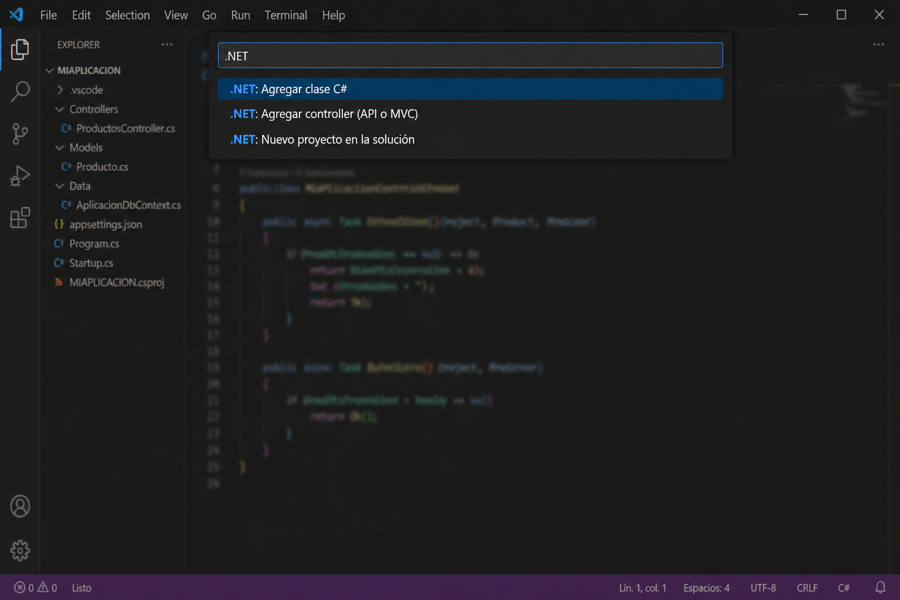
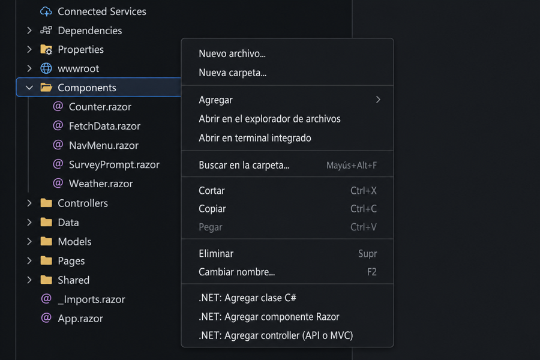

# .NET Convenience

## ☕ Support the project / Apoya el proyecto

.NET Convenience is an independent side project. If it helped you, a **$1 USD** coffee goes a long way — and, honestly, it also helps with a few personal goals (like my mortgage 😁).

👉 [Buy me a coffee (PayPal)](https://paypal.me/SIPTecMX)

⭐ A review on the Marketplace or a star on GitHub also makes a big difference.

---

Extension for **Visual Studio Code** and **Cursor** that adds shortcuts for common **.NET** workflows (complements C# Dev Kit and the SDK).

By [Johnny Sánchez / CreateIT](https://www.createit.com.mx) · [JohnnyC-SH](https://github.com/JohnnyC-SH)  
Repository: [github.com/JohnnyC-SH/DotNet_convenience](https://github.com/JohnnyC-SH/DotNet_convenience)

UI strings follow your editor language: **English** by default, **Spanish** when the display language is `es` (see `package.nls.*` and `l10n/bundle.l10n.*`).

---

## English

### Screenshots

Paths are **relative to the package** so they load on the extension page when installing from a VSIX.





### Requirements

- [.NET SDK](https://dotnet.microsoft.com/download) installed and on your `PATH`.
- Node.js only if you **compile** or **package** the extension from source.

### Commands (palette: `Cmd+Shift+P` / `Ctrl+Shift+P`)

Search for the **`.NET:`** prefix.

| Command | Short description |
|--------|-------------------|
| Add C# class | Creates a `.cs` with inferred namespace. |
| Add C# interface | Creates an interface in the project namespace. |
| Add Razor component | Creates a `.razor` with `@namespace`. |
| Add Razor page with `@page` | Creates a page with a configurable route. |
| Add controller (API or MVC) | Web API (`ControllerBase`) or MVC (`Controller`). |
| Add project reference | Runs `dotnet add … reference …`. |
| New project in solution | `dotnet new` and `dotnet sln add`. |

There are also entries in the file explorer **context menu** (folders and `.cs` / `.razor` files).

### Development

```bash
git clone https://github.com/JohnnyC-SH/DotNet_convenience.git
cd DotNet_convenience
npm install
npm run compile
```

Package as `.vsix`:

```bash
npx @vscode/vsce package
```

Install in Cursor/VS Code:

```bash
cursor --install-extension dotnet-convenience-0.2.7.vsix
# or: code --install-extension …
```

If you previously installed a build with publisher **`local`**, uninstall the duplicate (different extension id):

```bash
cursor --uninstall-extension local.dotnet-convenience
```

*(Adjust the `.vsix` filename to the current `package.json` version.)*

### Contributing

- **Issues:** [bugs and ideas](https://github.com/JohnnyC-SH/DotNet_convenience/issues).
- **Pull requests:** fork the repo, branch your change, and open a PR against `main` (or the repo default branch).

### More projects by Johnny Sánchez

| Project | What it is |
|---|---|
| [JohnnyMsgBox](https://github.com/JohnnyC-SH/JohnnyMsgBox) | MessageBox / dialogs / toasts for Blazor & HTML |
| [JohnnyIconMaker](https://github.com/JohnnyC-SH/JohnnyIconMaker) | App icon packing (Windows, macOS, mobile) |
| [create.it](https://www.createit.com.mx) | CreateIT website & brand |

### License

MIT — see `LICENSE` in this folder.

---

## Español

Extensión para **Visual Studio Code** y **Cursor** que añade atajos para flujos habituales de **.NET** (complementa C# Dev Kit y el SDK).

Por [Johnny Sánchez / CreateIT](https://www.createit.com.mx) · [JohnnyC-SH](https://github.com/JohnnyC-SH)  
Repositorio: [github.com/JohnnyC-SH/DotNet_convenience](https://github.com/JohnnyC-SH/DotNet_convenience)

*(En instalaciones por `.vsix`, Cursor/VS Code a veces **no muestra** el botón “Sponsor” del `package.json`; el enlace de PayPal del inicio es el que siempre funciona.)*

Los textos de la interfaz respetan el idioma del editor: **inglés** por defecto y **español** con idioma de visualización `es`.

### Capturas

Las rutas son **relativas al paquete** para que carguen en la ficha de la extensión al instalar desde VSIX.


### Requisitos

- [.NET SDK](https://dotnet.microsoft.com/download) instalado y en el `PATH`.
- Node.js solo si vas a **compilar** o **empaquetar** la extensión desde el código fuente.

### Comandos (paleta: `Cmd+Shift+P` / `Ctrl+Shift+P`)

Busca el prefijo **`.NET:`**.

| Comando | Descripción breve |
|--------|-------------------|
| Agregar clase C# | Crea un `.cs` con namespace inferido. |
| Agregar interfaz C# | Crea una interfaz en el namespace del proyecto. |
| Agregar componente Razor | Crea un `.razor` con `@namespace`. |
| Agregar página Razor con `@page` | Crea una página con ruta configurable. |
| Agregar controller (API o MVC) | Web API (`ControllerBase`) o MVC (`Controller`). |
| Agregar referencia a otro proyecto | Ejecuta `dotnet add … reference …`. |
| Nuevo proyecto en la solución | `dotnet new` y `dotnet sln add`. |

También hay entradas en el **menú contextual** del explorador de archivos (carpetas y archivos `.cs` / `.razor`).

### Desarrollo

```bash
git clone https://github.com/JohnnyC-SH/DotNet_convenience.git
cd DotNet_convenience
npm install
npm run compile
```

Empaquetar como `.vsix`:

```bash
npx @vscode/vsce package
```

Instalar en Cursor/VS Code:

```bash
cursor --install-extension dotnet-convenience-0.2.7.vsix
# o: code --install-extension …
```

Si antes instalaste la versión con publisher **`local`**, desinstala el duplicado (es otro id de extensión):

```bash
cursor --uninstall-extension local.dotnet-convenience
```

*(Ajusta el nombre del archivo `.vsix` a la versión actual del `package.json`.)*

### Colaboración

- **Issues:** [problemas y ideas](https://github.com/JohnnyC-SH/DotNet_convenience/issues).
- **Pull requests:** bifurca el repo, crea una rama con tu cambio y abre un PR contra `main` (o la rama por defecto del repo).

### Más proyectos de Johnny Sánchez

| Proyecto | Qué es |
|---|---|
| [JohnnyMsgBox](https://github.com/JohnnyC-SH/JohnnyMsgBox) | MessageBox / diálogos / toasts para Blazor y HTML |
| [JohnnyIconMaker](https://github.com/JohnnyC-SH/JohnnyIconMaker) | Generación / empaquetado de iconos (Win, Mac, móvil) |
| [create.it](https://www.createit.com.mx) | Sitio y marca CreateIT |

### Licencia

MIT — ver `LICENSE` en esta carpeta.
